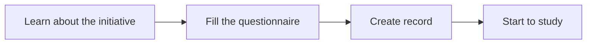

## Sign up Process

### 1. Learn about the initiative

**Before you formally sign up to participate in the "One Student One Chip" Initiative, please read the [Project Overview](/project/intro.html) section on the website**. The article starts with _Background_, _Goal_, _Highlights_, _Learning Route_, _Expected Harvest_ and other different perspectives provide a comprehensive and detailed explanation of the "One Student One Chip" Initiative, which allows students to have an basic understanding of the "One Student One Chip" Initiative before formal registration, and eliminate some misunderstandings caused by information asymmetry.

<!-- 此外，从第六期开始，“一生一芯”计划的学习流程发生了比较大的变化，建议每位同学都点击[这里](https://docs.qq.com/doc/DY1huTURndXpTdlZW)了解一下，便于大家在报名结束后规划和制订自己专属的学习路线。 -->

- [Overview video](https://www.bilibili.com/video/BV12e4y1Y76i/)
- [Introduction handout](https://ysyx.oscc.cc/slides/2205/01.html#/)
- [FAQ](/project/faq.html)

:::info Exchange ways

> |                                                                                   QQ Group 5                                                                                  |                                                                  QQ Group 4<el-badge value="Full"></el-badge>                                                                 |                                                                 QQ Group 3 <el-badge value="Full"></el-badge>                                                                 |                                                                 QQ Group 2 <el-badge value="Full"></el-badge>                                                                 |                                                                 QQ Group 1 <el-badge value="Full"></el-badge>                                                                 |
> | :---------------------------------------------------------------------------------------------------------------------------------------------------------------------------: | :---------------------------------------------------------------------------------------------------------------------------------------------------------------------------: | :---------------------------------------------------------------------------------------------------------------------------------------------------------------------------: | :---------------------------------------------------------------------------------------------------------------------------------------------------------------------------: | :---------------------------------------------------------------------------------------------------------------------------------------------------------------------------: |
> | <a qrcode-container :href="qrcodeQQGroup5" target="_blank"><qrcode-vue :value="qrcodeQQGroup5" :render-as="qrcodeRenderAs" :margin="qrcodeMargin" :level="qrcodeLevel" /></a> | <a qrcode-container :href="qrcodeQQGroup4" target="_blank"><qrcode-vue :value="qrcodeQQGroup4" :render-as="qrcodeRenderAs" :margin="qrcodeMargin" :level="qrcodeLevel" /></a> | <a qrcode-container :href="qrcodeQQGroup3" target="_blank"><qrcode-vue :value="qrcodeQQGroup3" :render-as="qrcodeRenderAs" :margin="qrcodeMargin" :level="qrcodeLevel" /></a> | <a qrcode-container :href="qrcodeQQGroup2" target="_blank"><qrcode-vue :value="qrcodeQQGroup2" :render-as="qrcodeRenderAs" :margin="qrcodeMargin" :level="qrcodeLevel" /></a> | <a qrcode-container :href="qrcodeQQGroup1" target="_blank"><qrcode-vue :value="qrcodeQQGroup1" :render-as="qrcodeRenderAs" :margin="qrcodeMargin" :level="qrcodeLevel" /></a> |
> |                                                            <a :href="qrcodeQQGroup5" target="_blank">513870270</a>                                                            |                                                            <a :href="qrcodeQQGroup4" target="_blank">884767063</a>                                                            |                                                            <a :href="qrcodeQQGroup3" target="_blank">621039593</a>                                                            |                                                            <a :href="qrcodeQQGroup2" target="_blank">528994030</a>                                                            |                                                            <a :href="qrcodeQQGroup1" target="_blank">663797655</a>                                                            |

:::

### 2. Fill the questionnaire

In order to ensure the accuracy of tracking data, please be sure to fill the [Sign up Questionnaire](https://www.wenjuan.com/s/YRBnamK/) carefully. After completing the questionnaire, you can scan the QR code to join "One Student One Chip" [Preliminary Exchange Group](https://docs.qq.com/doc/DSU1teVZLR1hDcG9P) starts formal learning.After completed all the tasks in the preliminary stage, you can submit an admission defense application to the TA online. **If you pass the defense assessment, you will get an exclusive student number**. This student number is very important and involves Learning Tracking, Group Meeting Report, Defense Assessment, Tape-out Docking and many other links in the later stage, so be sure to remember it (preferably in a local or online document).

:::info QR Code Information

> |                                                                           Sign up Questionnaire                                                                           |                                                                              Preliminary Exchange Group                                                                             |
> | :-----------------------------------------------------------------------------------------------------------------------------------------------------------------------: | :---------------------------------------------------------------------------------------------------------------------------------------------------------------------------------: |
> | <a qrcode-container :href="qrcodeSignup" target="_blank"><qrcode-vue :value="qrcodeSignup" :render-as="qrcodeRenderAs" :margin="qrcodeMargin" :level="qrcodeLevel" /></a> | <a qrcode-container :href="qrCodePreliminary" target="_blank"><qrcode-vue :value="qrCodePreliminary" :render-as="qrcodeRenderAs" :margin="qrcodeMargin" :level="qrcodeLevel" /></a> |

:::

### 3. Create record

In the process of learning "One Student One Chip", **please be sure to record your learning process in detail** (it does not have to be recorded every day, but it should be as detailed as possible). **This is an important reference for TA to grasp everyone’s learning progress and provide guidance**. In addition, through statistical analysis of the tape-out status of students in the previous batches of the "One Student One Chip" Initiative, we found that **students who often fill in more detailed study records have a high probability of persisting until the tape-out stage**. Therefore, it is very important to keep a good record of your own learning.The specific operation methods and precautions for creating learning records are as follows:

- Copy [Learning Record Template](https://docs.qq.com/sheet/DT2RPaWFzVGlzaG1T) to your Tencent Documents Account.
- Modify the name of the document according to the template prompts, the format is _ysyx_name-school-study record_.
- The content in the learning record is customizable, and you can add or modify some table columns according to your needs.
- After passing the admission defense, the **TA will create another learning record form** for each student. At that time, everyone will need to copy all the records in their preliminary stage into the new form.
- **Do not paste the code for completing a certain task in your study records** to prevent other students from learning from your ideas and losing the opportunity to practice.
- Complete learning records are a **necessary condition** for everyone to apply for tape-out and certification assessment. If the learning records are seriously missing, your application will not be passed normally.

### 4. Start to study

<el-row justify="center">
    <el-button size="large"
               type="primary"
               style="height:45px; font-size:16px;"
               @click="jumpToCourseHome">Course material portal
    </el-button>
</el-row>

