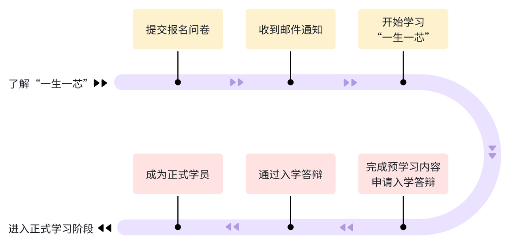

Thank you for participating in the "One Student One Chip" program! 😊 Here is the process for **One Student One Chip** from registration to official enrollment:

## :mag_right: Learn about the "One Student One Chip" project {data-ysyx-nav=Learn about project}

Before officially registering for the "One Student One Chip" program, please take the time to read the [**Project Overview**](/en/project/intro.html) section. This article provides a comprehensive and detailed explanation of the "One Student One Chip" program from various perspectives, including **Background and Current Situation**, **Goals and Philosophy**, **Project Highlights**, **Learning Path**, and **Expected Gains**. This will help students gain a basic understanding of the program before officially signing up and eliminate any misunderstandings that may arise due to information asymmetry.

- [Overview Video](https://www.bilibili.com/video/BV12e4y1Y76i/)
- [Introduction Slides](https://ysyx.oscc.cc/slides/2205/01.html#/)
- [FAQ](/en/project/faq.html)

::: info If you want to learn more about the "One Student, One Chip" program and engage in discussions with others, you can join the QQ group.

> You can scan the QR code or click on the QR code to open QQ and join the group chat.
> | QQ Group 5<el-badge value="Full"></el-badge> | QQ Group 4<el-badge value="已满"></el-badge> | QQ Group 3 <el-badge value="Full"></el-badge> | QQ Group 2 <el-badge value="Full"></el-badge> | QQ Group 1 <el-badge value="Full"></el-badge> |
> |:---:|:---:|:---:|:---:|:---:|
> | <a qrcode-container :href="qrcodeQQGroup5" target="_blank"><qrcode-vue :value="qrcodeQQGroup5" :render-as="qrcodeRenderAs" :margin="qrcodeMargin" :level="qrcodeLevel" /></a> | <a qrcode-container :href="qrcodeQQGroup4" target="_blank"><qrcode-vue :value="qrcodeQQGroup4" :render-as="qrcodeRenderAs" :margin="qrcodeMargin" :level="qrcodeLevel" /></a> | <a qrcode-container :href="qrcodeQQGroup3" target="_blank"><qrcode-vue :value="qrcodeQQGroup3" :render-as="qrcodeRenderAs" :margin="qrcodeMargin" :level="qrcodeLevel" /></a> | <a qrcode-container :href="qrcodeQQGroup2" target="_blank"><qrcode-vue :value="qrcodeQQGroup2" :render-as="qrcodeRenderAs" :margin="qrcodeMargin" :level="qrcodeLevel" /></a> | <a qrcode-container :href="qrcodeQQGroup1" target="_blank"><qrcode-vue :value="qrcodeQQGroup1" :render-as="qrcodeRenderAs" :margin="qrcodeMargin" :level="qrcodeLevel" /></a> |
> | <a :href="qrcodeQQGroup5" target="_blank">513870270</a> | <a :href="qrcodeQQGroup4" target="_blank">884767063</a> | <a :href="qrcodeQQGroup3" target="_blank">621039593</a> | <a :href="qrcodeQQGroup2" target="_blank">528994030</a> | <a :href="qrcodeQQGroup1" target="_blank">663797655</a> |
> | QQ Group 6 | | | | |
> | <a qrcode-container :href="qrcodeQQGroup6" target="_blank"><qrcode-vue :value="qrcodeQQGroup6" :render-as="qrcodeRenderAs" :margin="qrcodeMargin" :level="qrcodeLevel" /></a> | | | | |
> | <a :href="qrcodeQQGroup6" target="_blank">958585695</a> | | | | |
:::

## 🔥 Fill out the Signup Form {data-ysyx-nav=Signup}

We believe that you fully understand the "One Student One Chip" project. Before learning, please fill out the ✨ **"One Student One Chip" Signup Form**.

The "One Student One Chip" project team would like to understand your basic information for the purposes of [🎈 Learning Organization] and [🔎 Statistical Analysis] only, and will not be used for any other purposes. We respect your privacy, and the information provided will be kept strictly confidential 🔒.

::: warning
If the registration questionnaire displays **Not Available for Submission**, it means that **updates or maintenance** are in progress. Please come back and fill it out later.
:::

 

<el-row justify="center">
    <el-button  size="large"
                type="primary"
                class="custom-button"
                @click="jumpToEntryForm">🚀 Click to fill Signup Form
    </el-button>
</el-row>

 

## 📫 Check your email

After submitting the **Signup Form**, the "One Student One Chip" project team will send you an email.

You will receive an email marked 【:white_check_mark: **Signup Successful**】. This email will provide you with the **learning process and important notes** for the initial study of "One Student One Chip." If you do not receive it, please first check your 🗑 **spam folder**. If you still do not receive it after a few hours, please provide feedback on the issue.

::: tip 
The email is a new feature. Participants who registered before 15:00 on July 8, 2024, will not receive the email. These participants are successfully registered and it will not affect their subsequent learning.
:::

## 🚩 Starting

After registration, you can start learning "One Student One Chip"! You now need to complete the **pre-learning phase** tasks.

 

<el-row justify="center">
    <el-button size="large"
                type="primary"
                class="custom-button"
                @click="jumpToCourseHome">😎 Start learning "One Student One Chip"
    </el-button>
</el-row>

 

## 🔰 Subsequent Profcess

After completing the **pre-learning phase** tasks, you will be able to see the **admission defense application entry**. The subsequent process is as follows:

> Note: The specific details of the following process will be visible after you complete the pre-learning tasks. This section helps you **understand the entire process**.

1. Apply for the admission defense.
2. Participate in the admission defense.
3. :heavy_check_mark: Defense Passed, become a formal member of "One Student One Chip";
   :x: Defense Not Passed, you will need to address the issues according to the assistant’s feedback, return to step 1, and reapply for the defense.
4. Join the formal learning group.

## ❓ Problem Feedback
If you encounter issues that you cannot resolve, please join the WeChat group to provide feedback. You should only join this group if you experience problems during registration (e.g., encountering a bug while filling out the form, not receiving the email, having questions about the email notifications, etc.). Note that this group is **not** for learning-related questions.

<!-- ---------------------------------------------- -->

<ClientOnly><bottom-nav-bar/></ClientOnly>

<!-- ---------------------  phone-bottom-bar  ----------------------- -->

    <a href="https://ysyx.oscc.cc/" class="phone-bottom-button">
        ◀
        返回主页
    </a>
    <a href="#understandPlan" class="phone-bottom-button">
        🧐
        了解计划
    </a>
    <a href="#entryForm" class="phone-bottom-button">
        🔥
        报名参加
    </a>
    <a  href="https://ysyx.oscc.cc/docs/2306/preliminary/preliminary.html" target="_blank"
        class="phone-bottom-button">
        🚀
        开始学习
    </a>

<!-- -------------------------------------------------- -->

