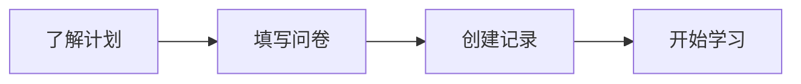

## 报名流程

报名参与“一生一芯”计划其实非常简单，只需依次完成上图中的4个步骤即可。

### 1、了解计划

**在正式报名参加“一生一芯”计划之前，请大家先阅读网站中的[《项目概述》](/ysyx-website/project/project-intro.html)部分**（对于之前从别的渠道了解“一生一芯”计划的同学，建议也从头到尾阅读一遍，毕竟官方发布的信息是最准确的），文章从不同的角度对“一生一芯”计划进行了全面且详细的阐述，可以让同学们在正式报名前对“一生一芯”计划有一个基本的认识，并消除一些因信息不对称所产生的误解。如果你愿意花费几分钟时间去阅读项目概述，并在深思熟虑之后依然决定报名参加“一生一芯”计划的话，那恭喜起你，你已经有半只脚踏入了处理器芯片学习的大门，那么就让我们赶快跳转到下一步吧。

除了网站中的《项目概述》之外，**我们还提供了以下资料供大家了解“一生一芯”计划**。总之，“一生一芯”致力于培养芯片设计人才，包括体系结构设计、RTL开发、SoC集成验证和后端物理设计等。所有对芯片设计感兴趣的同学（在校或已毕业），都欢迎随时报名参加“一生一芯”。

<BiliBili bvid="BV12e4y1Y76i" />

<!-- - [概述视频](https://www.bilibili.com/video/BV12e4y1Y76i/) -->
- [介绍课件](https://ysyx.oscc.cc/slides/2205/01.html#/)
- [常见问题](/ysyx-website/project/project-faq.html)

::: info 交流渠道
> | QQ 3群 | QQ 2群 <el-badge value="已满"></el-badge> | QQ 1群 <el-badge value="已满"></el-badge> |
> |:---:|:---:|:---:|
> | <a qrcode-container :href="qrcodeGroup3" target="_blank"><qrcode-vue :value="qrcodeGroup3" :render-as="qrcodeRenderAs" :margin="qrcodeMargin" :level="qrcodeLevel" /></a> | <a qrcode-container :href="qrcodeGroup2" target="_blank"><qrcode-vue :value="qrcodeGroup2" :render-as="qrcodeRenderAs" :margin="qrcodeMargin" :level="qrcodeLevel" /></a> | <a qrcode-container :href="qrcodeGroup1" target="_blank"><qrcode-vue :value="qrcodeGroup1" :render-as="qrcodeRenderAs" :margin="qrcodeMargin" :level="qrcodeLevel" /></a> |
> | <a :href="qrcodeGroup3" target="_blank">621039593</a> | <a :href="qrcodeGroup2" target="_blank">528994030</a> | <a :href="qrcodeGroup1" target="_blank">663797655</a> |
:::

### 2、填写问卷

由于网站的用户报名功能还未上线，所以目前还是请大家通过填写[《报名问卷》](https://www.wenjuan.com/s/2ENBzyA/#)的方式进行报名，并由此获得**唯一序号**（全部填写完成且点击【提交】按钮后会自动弹出）。这个序号是大家在“一生一芯”计划的**学号**，非常重要，涉及后期【在线记录】、【组会汇报】、【答辩考核】、【后端流片】等诸多环节，因此请务必记住（最好是记到一个本地或在线的文档中）。

::: warning 注意事项
如果你依然不小心忘记了自己的学号，也不必慌张，**更不用重复提交报名申请**，你要始终相信助教是你们最强大的后盾。截止到目前你可以填写[这个](https://docs.qq.com/sheet/DT0tNUENtZ2RHWWJ2?tab=BB08J2)文档来申请找回自己的学号，助教们1-2天会查阅一次这篇文档，并从后台将你的学号反馈到文档中。
:::

### 3、创建记录

大家在学习“一生一芯”的过程中，**请务必详细记录自己的学习过程**（不一定每天都要记录，但是要尽可能详实），**这是助教掌握大家学习进展并进行指导的重要参考**。经过对前几期“一生一芯”计划学员流片情况的统计分析，我们发现**往往学习记录填写的比较详细的同学，最后有很大的概率能够坚持到流片阶段**，从而实现带着自己设计的处理器芯片毕业这个伟大的梦想。此外，定期编写学习记录也能有效锻炼大家快速归纳知识点的能力并加深对某些技术难点或概念的理解程度，这是很多国内高校学生或甚至工程师都不具备的。因此，我们希望你在学习“一生一芯”的过程中，不仅技术水平（硬实力）能够得到提升，归纳总结（软实力）能力也可以同步向前发展，从而有机会蜕变成一名真正合格且优秀的“一生一芯”计划毕业生。

言归正传，创建学习记录的具体操作方法和相关注意事项如下所示：

- 复制[学习记录模版](https://docs.qq.com/sheet/DT2RPaWFzVGlzaG1T)到自己的腾讯文档账号中，并**打开【可查看】权限**。
- 按照模版提示修改文档的名字，格式为【ysyx_年份期次学号-姓名-学校-学习记录】。
- 学习记录中的内容是允许自定义的，如果你觉得整个模版设计的不合理，推倒重新设计也是没有问题的，但是其中有几项是必须要保留的：【每日任务名称】、【每日任务时长】、【任务完成情况】、【遇到问题和解决办法】、【经验总结或心得体会】（意思对即可，表格列不一定叫这个名字）。
- 在通过**预学习答辩**后连续四周时间不更新学习记录的同学，你的名单将有极大概率被助教移到待考察表格中。
- **最好不要在学习记录中贴自己完成某个任务的具体代码**，以防止别的同学“借鉴”你编写的代码。
- 完整的学习记录是大家最后进行答辩考核的**充分必要条件**，如果早期偷懒写得少的话，后期补起来还是很痛苦的。

### 4、开始学习

<el-row justify="center">
    <el-button size="large"
               type="primary"
               style="height:45px; font-size:16px;"
               @click="jumpToCourseHome">课程主页传送门
    </el-button>
</el-row>

