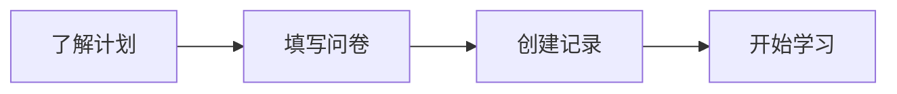

## 报名流程

### 1、了解计划

**在正式报名参加“一生一芯”计划之前，请大家先阅读网站中的[《项目概述》](/project/intro.html)部分**，文章从【背景现状】、【目标理念】、【项目亮点】、【学习路线】、【预期收获】等不同角度对“一生一芯”计划进行了全面且详细的阐述，可以让同学们在正式报名前对“一生一芯”计划有一个基本的认识，并消除一些因信息不对称所产生的误解。此外，从第六期开始，“一生一芯”计划的学习流程发生了比较大的变化，建议每位同学都点击[这里](https://docs.qq.com/doc/DY1huTURndXpTdlZW)了解一下，便于大家在报名结束后规划和制订自己专属的学习路线。

<!-- <BiliBili bvid="BV12e4y1Y76i" /> -->

- [概述视频](https://www.bilibili.com/video/BV12e4y1Y76i/)
- [介绍课件](https://ysyx.oscc.cc/slides/2205/01.html#/)
- [常见问题](/project/faq.html)

::: info 交流渠道
> | QQ 4群 | QQ 3群 <el-badge value="已满"></el-badge> | QQ 2群 <el-badge value="已满"></el-badge> | QQ 1群 <el-badge value="已满"></el-badge> |
> |:---:|:---:|:---:|:---:|
> | <a qrcode-container :href="qrcodeQQGroup4" target="_blank"><qrcode-vue :value="qrcodeQQGroup4" :render-as="qrcodeRenderAs" :margin="qrcodeMargin" :level="qrcodeLevel" /></a> | <a qrcode-container :href="qrcodeQQGroup3" target="_blank"><qrcode-vue :value="qrcodeQQGroup3" :render-as="qrcodeRenderAs" :margin="qrcodeMargin" :level="qrcodeLevel" /></a> | <a qrcode-container :href="qrcodeQQGroup2" target="_blank"><qrcode-vue :value="qrcodeQQGroup2" :render-as="qrcodeRenderAs" :margin="qrcodeMargin" :level="qrcodeLevel" /></a> | <a qrcode-container :href="qrcodeQQGroup1" target="_blank"><qrcode-vue :value="qrcodeQQGroup1" :render-as="qrcodeRenderAs" :margin="qrcodeMargin" :level="qrcodeLevel" /></a> |
> | <a :href="qrcodeQQGroup4" target="_blank">884767063</a> | <a :href="qrcodeQQGroup3" target="_blank">621039593</a> | <a :href="qrcodeQQGroup2" target="_blank">528994030</a> | <a :href="qrcodeQQGroup1" target="_blank">663797655</a> |
:::

<!-- ::: warning 活动公告
第六期“一生一芯”计划即将于2023年7月2日启动，待第六期宣讲会结束后会重新开启报名通道。具体情况请查看[首页公告](/)。
::: -->

### 2、填写问卷

<!-- ::: warning
第六期启动会结束后公布。
::: -->

为了确保追踪数据的准确性，请大家务必认真填写[《报名问卷》](https://www.wenjuan.com/s/YRBnamK/)，问卷填写完成即可扫码加入“一生一芯”[预学习交流群](https://docs.qq.com/doc/DSU1teVZLR1hDcG9P)开始正式学习。等大家完成所有预学习阶段的任务后，可以在线向助教提交入学答辩申请，**答辩考核通过会得到专属学号**，这个学号非常重要，涉及后期【学习追踪】、【组会汇报】、【答辩考核】、【流片对接】等诸多环节，因此请务必记住（最好是记到一个本地或在线的文档中）。

<!-- ::: warning 注意事项
对于已经通过入学答辩的同学，如果你不小心忘记了自己的学号，**不用重复提交入学答辩申请**。截止到目前你可以填写[这个](https://docs.qq.com/sheet/DT0tNUENtZ2RHWWJ2?tab=BB08J2)文档来申请找回自己的学号，助教们1-2天会查阅一次这篇文档，并从后台将你的学号反馈到文档中。
::: -->

### 3、创建记录

<!-- ::: warning
第六期启动会结束后公布。
::: -->

大家在学习“一生一芯”的过程中，**请务必详细记录自己的学习过程**（不一定每天都要记录，但是要尽可能详实），**这是助教掌握大家学习进展并进行指导的重要参考**。此外，经过对前几期“一生一芯”计划学员流片情况的统计分析，我们发现**往往学习记录填写的比较详细的同学，最后有很大的概率能够坚持到流片阶段**，所以记录好自己的学习记录是非常重要的。关于创建学习记录的具体操作方法和注意事项如下所示：

- 复制[学习记录模版](https://docs.qq.com/sheet/DT2RPaWFzVGlzaG1T)到自己的腾讯文档账号中。
- 按照模版提示修改文档的名字，格式为【ysyx_姓名-学校-学习记录】。
- 学习记录中的内容是允许自定义的，你可以根据自己的需求添加或修改一些表格列。
- 通过入学答辩后，**助教会为每一位同学再创建一个学习记录表**，届时大家需要将自己预学习阶段的所有记录内容复制到新表格中。
- **不要在学习记录中粘贴自己完成某个任务的代码**，以防止别的同学借鉴你的思路而失去锻炼的机会。
- 完整的学习记录是大家申请流片和认证考核的**必要条件**，如果学习记录缺失比较严重，你的申请将无法正常通过。

### 4、开始学习

<el-row justify="center">
    <el-button size="large"
               type="primary"
               style="height:45px; font-size:16px;"
               @click="jumpToCourseHome">课程资料传送门
    </el-button>
</el-row>

