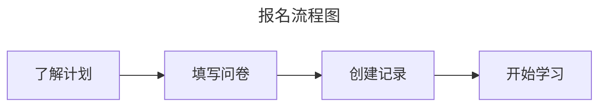

## 报名流程

### 了解计划

在正式报名参加“一生一芯”计划之前，请先阅读

### 填写问卷

### 创建记录

### 开始学习

“一生一芯”致力于培养芯片设计人才，包括体系结构设计、RTL开发、SoC集成验证和后端物理设计等。所有对芯片设计感兴趣的同学（在校或已毕业），都欢迎随时报名参加“一生一芯”。

<!-- > #### info:: 获取项目信息和最新动态
> -->
<!-- > | QQ **3**群 | QQ **2**群<badge type="solid red">已满</badge> | QQ **1**群<badge type="solid red">已满</badge> |
> |:---------------:|:---------------:|:---------------:|
> | <a qr-code :href="QGroup_3" target="_blank"><qrcode :value="QGroup_3" level="L" render-as="svg" background="#FFFA" foreground="var(--c-brand-dark)" margin="3" /></a> | <a qr-code :href="QGroup_2" target="_blank"><qrcode :value="QGroup_2" level="L" render-as="svg" background="#FFFA" foreground="var(--ct-gray-light)" margin="2" /></a> | <a qr-code :href="QGroup_1" target="_blank"><qrcode :value="QGroup_1" level="L" render-as="svg" background="#FFFA" foreground="var(--ct-gray-light)" margin="2" /></a> |
> | <a :href="QGroup_3" target="_blank">621039593</a> | <a :href="QGroup_2" target="_blank">528994030</a> | <a :href="QGroup_1" target="_blank">663797655</a> | -->

## 了解计划

在决定是否报名之前，你可以通过以下途径了解“一生一芯”
* 观看["一生一芯"概述 - 第五期"一生一芯"教学视频回放 - P1](https://www.bilibili.com/video/BV12e4y1Y76i/)
  * [课件](https://ysyx.oscc.cc/slides/2205/01.html#/)
* 阅读[报名常见问题](faq.md)

## 立即报名
请大家先填写 <btn type="solid gray-brand" href="https://www.wenjuan.com/s/2ENBzyA/#" style="display: inline-block">报名问卷</btn> ，填写成功后弹出的「序号」，即为大家在 “一生一芯” 的「学号」，请大家务必记住。

如果一不小心没记住学号，也不用重复提交申请，填写【[忘记了学号？](https://docs.qq.com/sheet/DT0tNUENtZ2RHWWJ2?tab=BB08J2)】这个文档，助教会定期查看，并把你的学号反馈上去。

> 报名助教或实习，可以发送简历到 [实习生招聘邮箱](mailto:opensource-talents@bosc.ac.cn?subject=%E4%B8%80%E7%94%9F%E4%B8%80%E8%8A%AF%E5%AE%9E%E4%B9%A0%E7%94%B3%E8%AF%B7&body=%E8%AF%B7%E6%B3%A8%E6%98%8E%E3%80%8C%E6%96%B9%E5%90%91%E3%80%8D%E3%80%81%E3%80%8C%E5%A7%93%E5%90%8D%E3%80%8D%E3%80%81%E3%80%8C%E5%AD%A6%E6%A0%A1%EF%BC%88%E6%88%96%E6%89%80%E5%B1%9E%E6%9C%BA%E6%9E%84%EF%BC%89%E3%80%8D)，注明【方向-姓名-学校】

## 创建记录

大家在学习过程中，请务必详细记录自己的学习过程，这是助教掌握大家学习进展，指导大家学习方法的重要参考。
为此，请大家填写“学习记录表”和“实验报告”。

> [学习记录表(模板)](https://docs.qq.com/sheet/DT2RPaWFzVGlzaG1T)
>
> 请大家复制一份到自己的账号，并打开 “可查看” 权限
>
> 实验报告的模板可自定义，主要包括：
>  * 遇到的问题和思考
>  * 你的其它想法, 例如实验心得, 对提供帮助的同学的感谢等
>  * 如果有粘贴代码和贴图，请附上对应的详细解释

## 课程学习

<!-- <container flex-row flex-center>
    <btn
        type="solid gray-brand"
        to="../../schedule.html"
        style="display: inline-block; padding: 1em 2em;"
    >
        课程主页传送门
    </btn>
</container> -->
